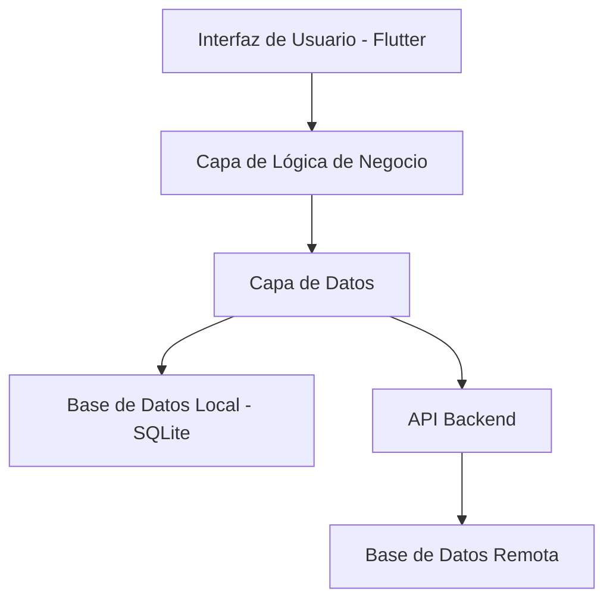
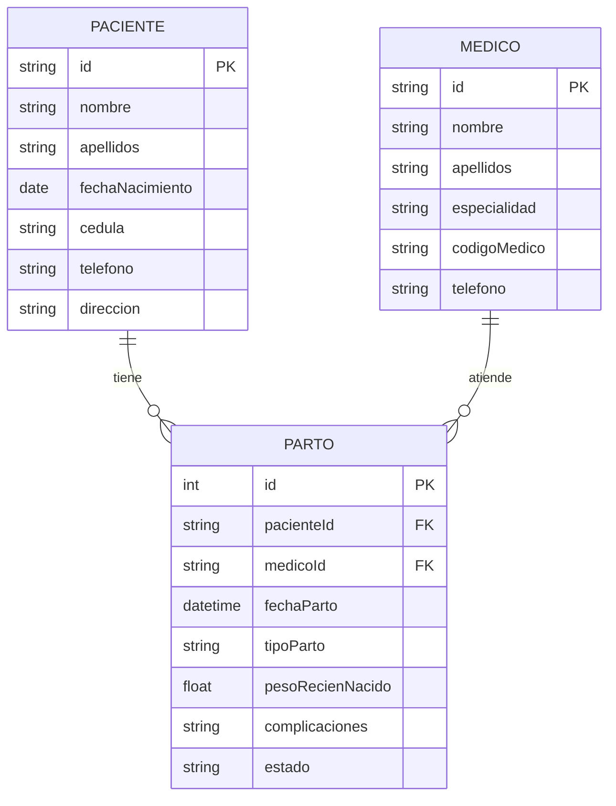
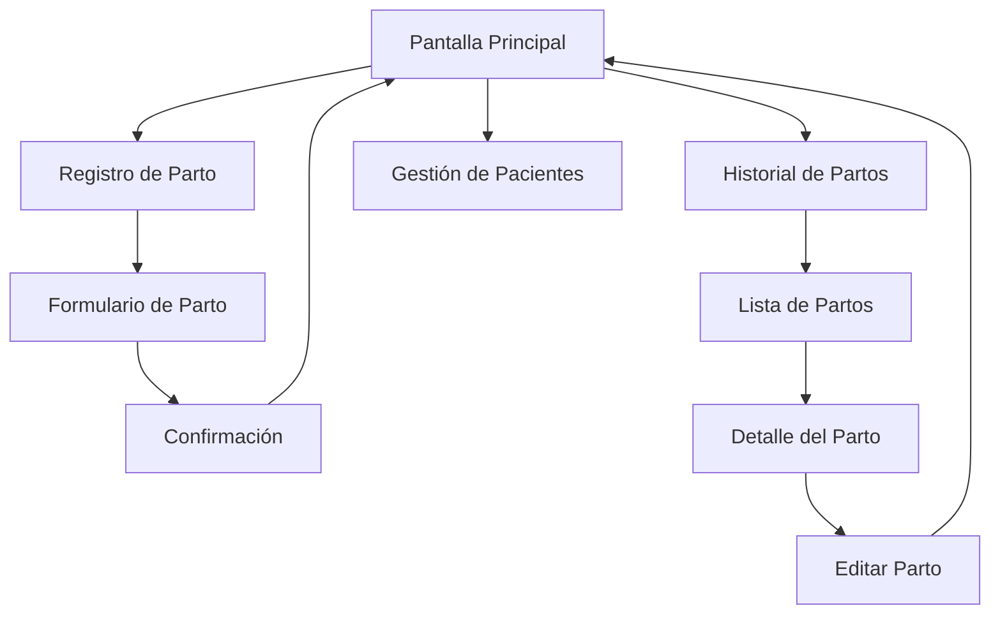

# Documentación PartosApp

## 1. Introducción

PartosApp es una aplicación móvil desarrollada en Flutter para el registro y gestión de partos en entornos hospitalarios. La aplicación permite a los profesionales de la salud registrar, consultar y gestionar información relacionada con los partos de manera eficiente y segura.

## 2. Arquitectura del Sistema

### 2.1 Arquitectura General



### 2.2 Estructura de Carpetas

```
lib/
├── main.dart
├── models/
│   ├── parto.dart
│   ├── paciente.dart
│   └── medico.dart
├── screens/
│   ├── home_screen.dart
│   ├── registro_parto_screen.dart
│   └── historial_screen.dart
├── services/
│   ├── database_service.dart
│   └── api_service.dart
├── widgets/
│   ├── custom_button.dart
│   └── form_fields.dart
└── utils/
    ├── constants.dart
    └── validators.dart
```

## 3. Modelos de Datos

### 3.1 Modelo Parto

```dart
class Parto {
  int? id;
  String pacienteId;
  String medicoId;
  DateTime fechaParto;
  String tipoParto;
  double pesoRecienNacido;
  String complicaciones;
  String estado;
  
  Parto({
    this.id,
    required this.pacienteId,
    required this.medicoId,
    required this.fechaParto,
    required this.tipoParto,
    required this.pesoRecienNacido,
    required this.complicaciones,
    required this.estado,
  });
}
```

### 3.2 Diagrama de Entidad-Relación



## 4. Funcionalidades Principales

### 4.1 Registro de Partos

- Formulario completo para registro de nuevos partos
- Validación de datos en tiempo real
- Guardado automático de borradores
- Confirmación antes del registro final

### 4.2 Consulta de Historial

- Lista de partos registrados
- Filtros por fecha, médico y paciente
- Búsqueda por nombre de paciente
- Ordenamiento personalizable

### 4.3 Gestión de Pacientes

- Registro de nuevos pacientes
- Actualización de información existente
- Historial médico por paciente

## 5. Flujo de Navegación



## 6. Base de Datos

### 6.1 Esquema de Base de Datos

```sql
-- Tabla Pacientes
CREATE TABLE pacientes (
    id TEXT PRIMARY KEY,
    nombre TEXT NOT NULL,
    apellidos TEXT NOT NULL,
    fecha_nacimiento DATE,
    cedula TEXT UNIQUE,
    telefono TEXT,
    direccion TEXT,
    created_at DATETIME DEFAULT CURRENT_TIMESTAMP
);

-- Tabla Médicos
CREATE TABLE medicos (
    id TEXT PRIMARY KEY,
    nombre TEXT NOT NULL,
    apellidos TEXT NOT NULL,
    especialidad TEXT,
    codigo_medico TEXT UNIQUE,
    telefono TEXT,
    created_at DATETIME DEFAULT CURRENT_TIMESTAMP
);

-- Tabla Partos
CREATE TABLE partos (
    id INTEGER PRIMARY KEY AUTOINCREMENT,
    paciente_id TEXT,
    medico_id TEXT,
    fecha_parto DATETIME,
    tipo_parto TEXT,
    peso_recien_nacido REAL,
    complicaciones TEXT,
    estado TEXT,
    created_at DATETIME DEFAULT CURRENT_TIMESTAMP,
    updated_at DATETIME DEFAULT CURRENT_TIMESTAMP,
    FOREIGN KEY (paciente_id) REFERENCES pacientes(id),
    FOREIGN KEY (medico_id) REFERENCES medicos(id)
);
```

## 7. Servicios

### 7.1 Servicio de Base de Datos

```dart
class DatabaseService {
  static Database? _database;
  
  Future<Database> get database async {
    if (_database != null) return _database!;
    _database = await _initDB();
    return _database!;
  }
  
  Future<int> insertParto(Parto parto) async {
    final db = await database;
    return await db.insert('partos', parto.toMap());
  }
  
  Future<List<Parto>> getPartos() async {
    final db = await database;
    final maps = await db.query('partos');
    return List.generate(maps.length, (i) => Parto.fromMap(maps[i]));
  }
}
```

## 8. Interfaz de Usuario

### 8.1 Pantalla Principal

- Dashboard con estadísticas principales
- Accesos rápidos a funcionalidades principales
- Notificaciones y alertas

### 8.2 Formulario de Registro

- Campos organizados en secciones lógicas
- Validación en tiempo real
- Autocompletado para pacientes existentes
- Selección de fecha y hora intuitiva

## 9. Seguridad y Privacidad

### 9.1 Medidas de Seguridad

- Encriptación de datos sensibles
- Autenticación de usuarios
- Control de acceso por roles
- Logs de auditoría

### 9.2 Cumplimiento Normativo

- Cumplimiento con HIPAA
- Protección de datos personales
- Políticas de retención de datos

## 10. Instalación y Configuración

### 10.1 Requisitos del Sistema

- Flutter SDK 3.0+
- Dart 2.17+
- Android API Level 21+
- iOS 11.0+

### 10.2 Instalación

```bash
# Clonar repositorio
git clone https://github.com/usuario/partosapp.git

# Instalar dependencias
flutter pub get

# Ejecutar aplicación
flutter run
```

## 11. Testing

### 11.1 Estrategia de Testing

- Unit tests para modelos y servicios
- Widget tests para componentes UI
- Integration tests para flujos completos

### 11.2 Cobertura de Pruebas

- Modelos: 95%
- Servicios: 90%
- Widgets: 85%
- Integración: 80%

## 12. Deployment

### 12.1 Proceso de Build

```bash
# Android
flutter build apk --release

# iOS
flutter build ios --release
```

### 12.2 Distribución

- Google Play Store para Android
- App Store para iOS
- Distribución interna para pruebas

## 13. Mantenimiento

### 13.1 Actualizaciones

- Actualizaciones mensuales de seguridad
- Nuevas funcionalidades trimestrales
- Migración de datos automática

### 13.2 Soporte

- Documentación técnica actualizada
- Sistema de tickets para incidencias
- Capacitación para usuarios finales