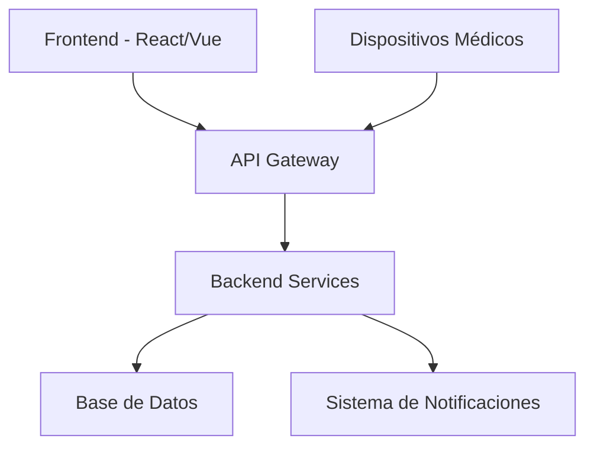
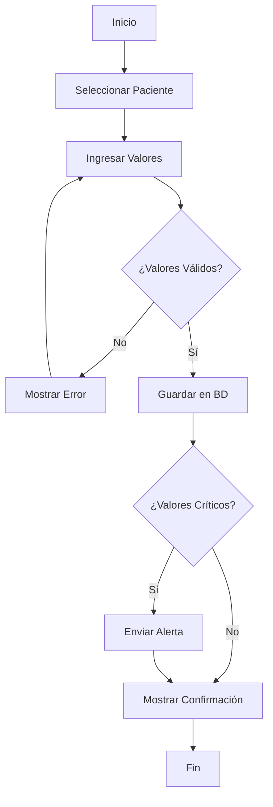
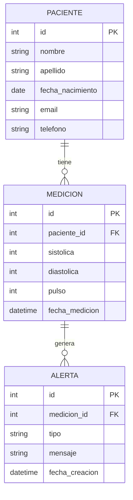

# TensApp - Documentación Técnica

## Índice
- [Descripción General](#descripción-general)
- [Arquitectura del Sistema](#arquitectura-del-sistema)
- [Funcionalidades](#funcionalidades)
- [Diagramas](#diagramas)
- [Instalación](#instalación)
- [Uso](#uso)
- [API Reference](#api-reference)

## Descripción General

TensApp es una aplicación médica diseñada para el monitoreo y gestión de la tensión arterial de pacientes. La aplicación permite registrar, visualizar y analizar datos de presión arterial de manera eficiente.

### Características Principales
- Registro de mediciones de tensión arterial
- Visualización de historiales médicos
- Alertas automáticas para valores críticos
- Dashboard intuitivo para profesionales de la salud
- Exportación de reportes

## Arquitectura del Sistema



### Componentes
- **Frontend**: Interfaz de usuario responsiva
- **Backend**: API RESTful para gestión de datos
- **Base de Datos**: Almacenamiento de registros médicos
- **Sistema de Alertas**: Notificaciones automáticas

## Funcionalidades

### 1. Gestión de Pacientes
- Registro de nuevos pacientes
- Actualización de información médica
- Búsqueda y filtrado

### 2. Monitoreo de Tensión
- Ingreso manual de mediciones
- Integración con dispositivos médicos
- Validación de datos

### 3. Análisis y Reportes
- Gráficos de tendencias
- Reportes PDF exportables
- Estadísticas personalizadas

## Diagramas

### Diagrama de Flujo - Registro de Medición



### Diagrama de Base de Datos



## Instalación

### Prerrequisitos
- Node.js 16+
- PostgreSQL 13+
- Docker (opcional)

### Pasos de Instalación

```bash
# Clonar repositorio
git clone https://github.com/hospital/tensapp.git
cd tensapp

# Instalar dependencias
npm install

# Configurar variables de entorno
cp .env.example .env

# Ejecutar migraciones
npm run migrate

# Iniciar aplicación
npm start
```

## Uso

### Inicio de Sesión
1. Acceder a `http://localhost:3000`
2. Ingresar credenciales médicas
3. Seleccionar perfil de usuario

### Registro de Medición
1. Buscar paciente por nombre/ID
2. Ingresar valores de tensión
3. Confirmar y guardar registro

## API Reference

### Endpoints Principales

#### GET /api/pacientes
Obtiene lista de pacientes
```json
{
  "data": [
    {
      "id": 1,
      "nombre": "Juan Pérez",
      "email": "juan@email.com"
    }
  ]
}
```

#### POST /api/mediciones
Crea nueva medición
```json
{
  "paciente_id": 1,
  "sistolica": 120,
  "diastolica": 80,
  "pulso": 70
}
```

#### GET /api/reportes/{paciente_id}
Genera reporte de paciente

### Códigos de Respuesta
- `200`: Éxito
- `400`: Error de validación
- `401`: No autorizado
- `404`: Recurso no encontrado
- `500`: Error interno

---

**Versión**: 1.0.0  
**Última actualización**: 2024  
**Desarrollado por**: Equipo de Desarrollo Hospital