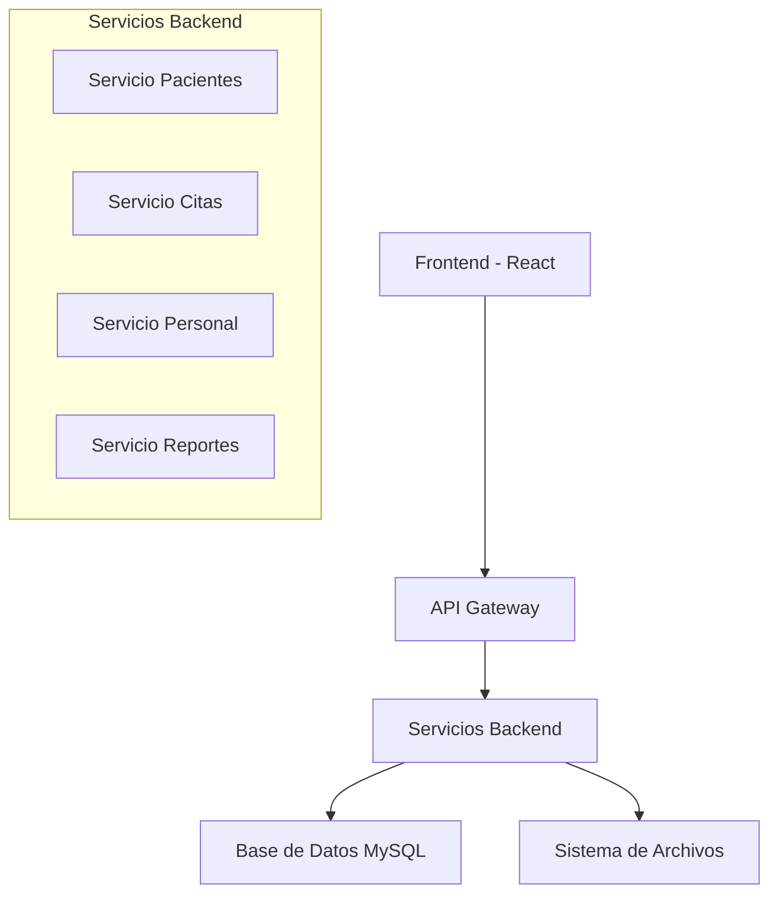
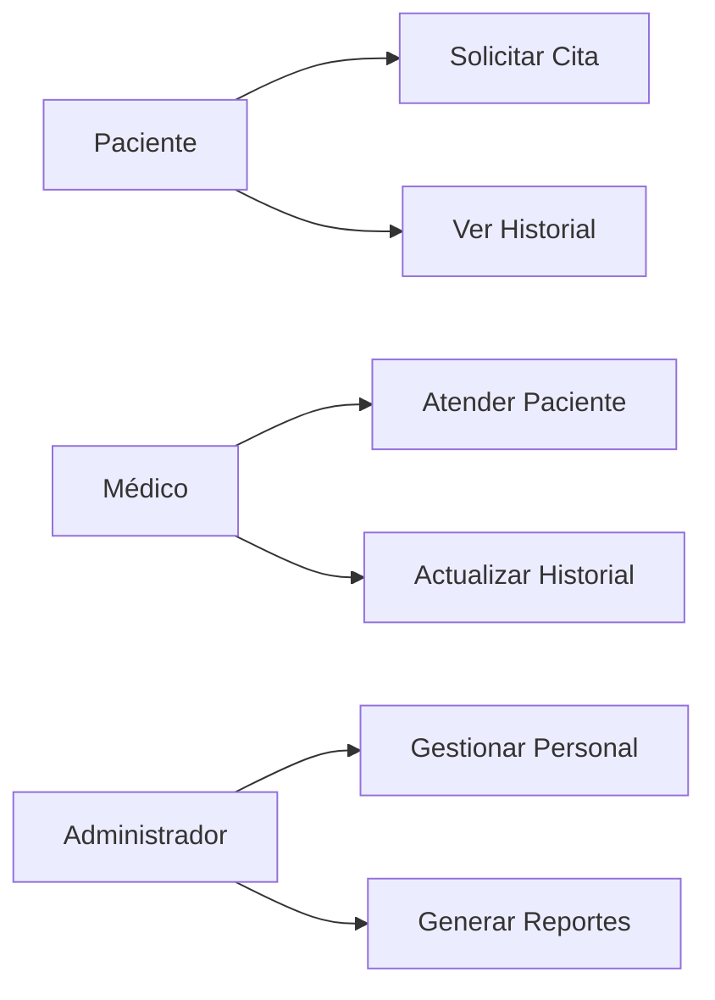
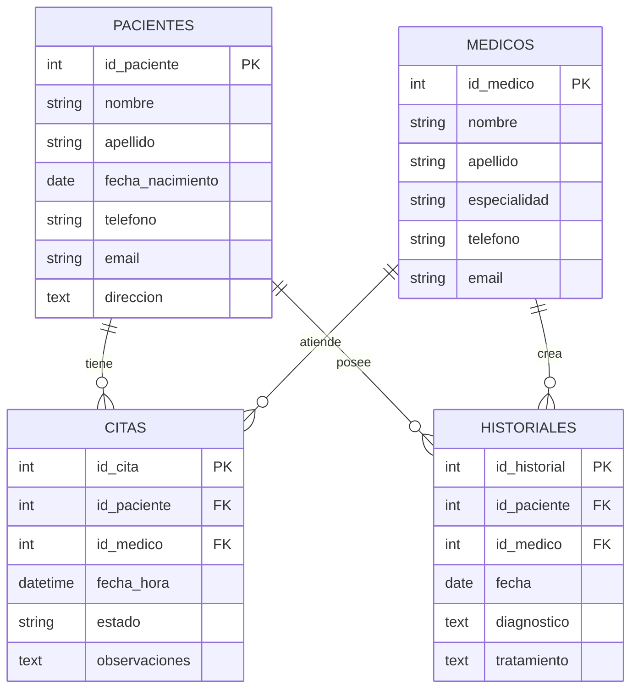
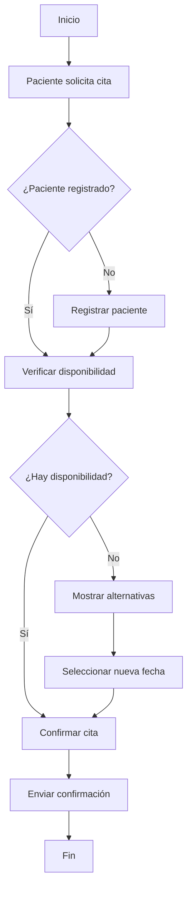

# Documentación GestionApp - Sistema de Gestión Hospitalaria

## Tabla de Contenidos
1. [Descripción General](#descripción-general)
2. [Arquitectura del Sistema](#arquitectura-del-sistema)
3. [Módulos del Sistema](#módulos-del-sistema)
4. [Diagramas](#diagramas)
5. [Instalación y Configuración](#instalación-y-configuración)
6. [API Reference](#api-reference)
7. [Base de Datos](#base-de-datos)

## Descripción General

GestionApp es un sistema integral de gestión hospitalaria diseñado para optimizar los procesos administrativos y clínicos en instituciones de salud. El sistema permite la gestión de pacientes, personal médico, citas, historiales clínicos y recursos hospitalarios.

### Características Principales
- Gestión de pacientes y historiales médicos
- Programación y seguimiento de citas
- Administración de personal médico
- Control de inventario farmacéutico
- Reportes y estadísticas
- Sistema de autenticación y autorización

## Arquitectura del Sistema



### Stack Tecnológico
- **Frontend**: React.js, Bootstrap
- **Backend**: Node.js, Express.js
- **Base de Datos**: MySQL
- **Autenticación**: JWT
- **Documentación**: Swagger/OpenAPI

## Módulos del Sistema

### 1. Gestión de Pacientes
- Registro de nuevos pacientes
- Actualización de información personal
- Historial médico completo
- Búsqueda y filtrado avanzado

### 2. Sistema de Citas
- Programación de citas médicas
- Calendario de disponibilidad
- Notificaciones automáticas
- Reagendamiento y cancelaciones

### 3. Gestión de Personal
- Registro de médicos y enfermeros
- Horarios y turnos
- Especialidades médicas
- Control de accesos

### 4. Inventario Farmacéutico
- Control de medicamentos
- Alertas de stock bajo
- Caducidad de productos
- Reportes de consumo

## Diagramas

### Diagrama de Casos de Uso



### Diagrama de Base de Datos



### Diagrama de Flujo - Proceso de Cita



## Instalación y Configuración

### Prerrequisitos
- Node.js v14+
- MySQL 8.0+
- npm o yarn

### Pasos de Instalación

1. **Clonar el repositorio**
```bash
git clone https://github.com/hospital/gestionapp.git
cd gestionapp
```

2. **Instalar dependencias**
```bash
npm install
```

3. **Configurar base de datos**
```sql
CREATE DATABASE gestion_hospital;
USE gestion_hospital;
-- Ejecutar scripts de creación de tablas
```

4. **Configurar variables de entorno**
```env
DB_HOST=localhost
DB_USER=root
DB_PASSWORD=password
DB_NAME=gestion_hospital
JWT_SECRET=your_secret_key
```

5. **Iniciar la aplicación**
```bash
npm run dev
```

## API Reference

### Endpoints Principales

#### Pacientes
- `GET /api/pacientes` - Obtener todos los pacientes
- `POST /api/pacientes` - Crear nuevo paciente
- `PUT /api/pacientes/:id` - Actualizar paciente
- `DELETE /api/pacientes/:id` - Eliminar paciente

#### Citas
- `GET /api/citas` - Obtener todas las citas
- `POST /api/citas` - Crear nueva cita
- `PUT /api/citas/:id` - Actualizar cita
- `DELETE /api/citas/:id` - Cancelar cita

### Ejemplo de Respuesta API

```json
{
  "status": "success",
  "data": {
    "id": 1,
    "nombre": "Juan",
    "apellido": "Pérez",
    "email": "juan.perez@email.com",
    "telefono": "+1234567890"
  },
  "message": "Paciente creado exitosamente"
}
```

## Base de Datos

### Estructura de Tablas

#### Tabla Pacientes
| Campo | Tipo | Descripción |
|-------|------|-------------|
| id_paciente | INT | Clave primaria |
| nombre | VARCHAR(50) | Nombre del paciente |
| apellido | VARCHAR(50) | Apellido del paciente |
| fecha_nacimiento | DATE | Fecha de nacimiento |
| telefono | VARCHAR(15) | Número telefónico |
| email | VARCHAR(100) | Correo electrónico |

#### Tabla Médicos
| Campo | Tipo | Descripción |
|-------|------|-------------|
| id_medico | INT | Clave primaria |
| nombre | VARCHAR(50) | Nombre del médico |
| apellido | VARCHAR(50) | Apellido del médico |
| especialidad | VARCHAR(100) | Especialidad médica |
| telefono | VARCHAR(15) | Número telefónico |

### Procedimientos Almacenados

```sql
DELIMITER //
CREATE PROCEDURE ObtenerCitasPorMedico(IN medico_id INT)
BEGIN
    SELECT c.*, p.nombre, p.apellido 
    FROM citas c 
    JOIN pacientes p ON c.id_paciente = p.id_paciente 
    WHERE c.id_medico = medico_id;
END //
DELIMITER ;
```

## Seguridad

### Autenticación JWT
- Tokens con expiración de 24 horas
- Refresh tokens para sesiones prolongadas
- Encriptación de contraseñas con bcrypt

### Permisos por Rol
- **Administrador**: Acceso completo
- **Médico**: Gestión de pacientes y citas
- **Recepcionista**: Gestión de citas únicamente

## Mantenimiento y Soporte

### Logs del Sistema
- Ubicación: `/logs/application.log`
- Rotación diaria
- Niveles: ERROR, WARN, INFO, DEBUG

### Respaldos
- Respaldo automático diario de BD
- Retención por 30 días
- Ubicación: `/backups/`

---

**Versión**: 1.0.0  
**Última actualización**: 2024  
**Contacto**: soporte@gestionapp.com