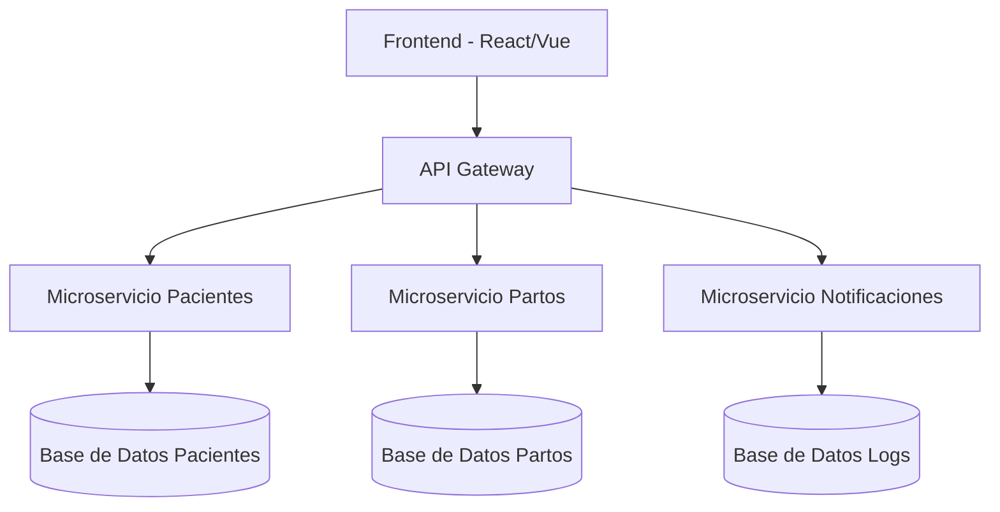
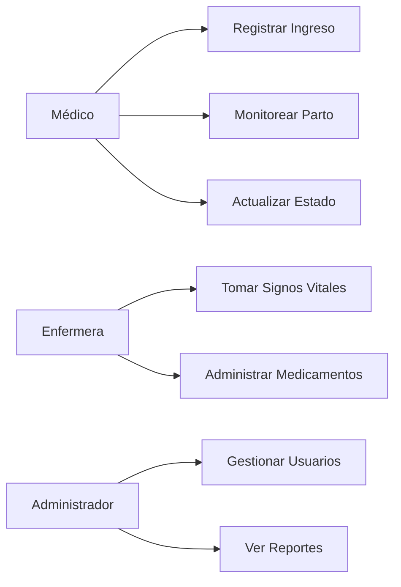
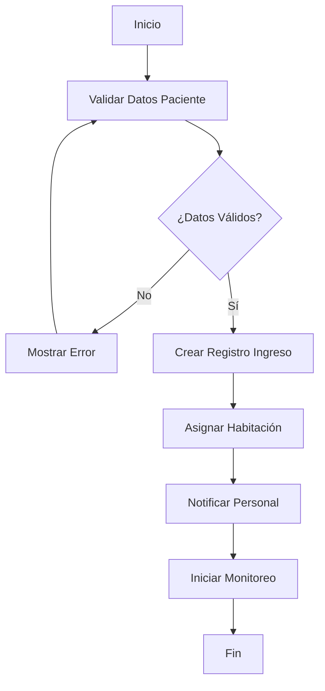
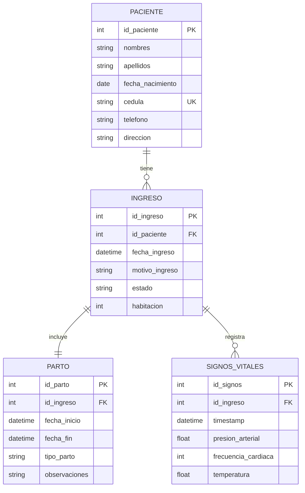

# Documentación - IngresoPartoApp

## Tabla de Contenidos
- [Introducción](#introducción)
- [Arquitectura del Sistema](#arquitectura-del-sistema)
- [Diagramas](#diagramas)
- [Funcionalidades](#funcionalidades)
- [Instalación y Configuración](#instalación-y-configuración)
- [API Reference](#api-reference)
- [Base de Datos](#base-de-datos)
- [Flujo de Trabajo](#flujo-de-trabajo)

## Introducción

IngresoPartoApp es una aplicación para la gestión de ingresos y atención obstétrica en centros hospitalarios. Permite registrar, monitorear y gestionar el proceso de parto de las pacientes.

## Arquitectura del Sistema



## Diagramas

### Diagrama de Casos de Uso



### Diagrama de Flujo - Proceso de Ingreso



### Diagrama de Base de Datos



## Funcionalidades

### 1. Gestión de Pacientes
- Registro de nuevas pacientes
- Búsqueda y actualización de datos
- Historial médico

### 2. Control de Ingresos
- Registro de ingreso para parto
- Asignación de habitaciones
- Estado del proceso

### 3. Monitoreo del Parto
- Seguimiento en tiempo real
- Registro de signos vitales
- Alertas médicas

### 4. Reportes y Estadísticas
- Reportes de actividad
- Métricas de desempeño
- Exportación de datos

## Instalación y Configuración

### Prerrequisitos
```bash
- Node.js >= 14.0
- PostgreSQL >= 12.0
- Redis >= 6.0
```

### Instalación
```bash
# Clonar repositorio
git clone https://github.com/hospital/ingreso-parto-app.git

# Instalar dependencias
npm install

# Configurar variables de entorno
cp .env.example .env

# Ejecutar migraciones
npm run migrate

# Iniciar aplicación
npm run start
```

## API Reference

### Endpoints Principales

#### Pacientes
```http
GET /api/pacientes
POST /api/pacientes
GET /api/pacientes/:id
PUT /api/pacientes/:id
DELETE /api/pacientes/:id
```

#### Ingresos
```http
GET /api/ingresos
POST /api/ingresos
GET /api/ingresos/:id
PUT /api/ingresos/:id/estado
```

#### Partos
```http
GET /api/partos
POST /api/partos
PUT /api/partos/:id
GET /api/partos/:id/signos-vitales
```

### Ejemplo de Request
```json
POST /api/ingresos
{
  "id_paciente": 123,
  "motivo_ingreso": "Trabajo de parto",
  "fecha_ingreso": "2024-01-15T10:30:00Z",
  "habitacion": 201
}
```

### Ejemplo de Response
```json
{
  "success": true,
  "data": {
    "id_ingreso": 456,
    "id_paciente": 123,
    "estado": "activo",
    "fecha_ingreso": "2024-01-15T10:30:00Z"
  },
  "message": "Ingreso registrado exitosamente"
}
```

## Base de Datos

### Configuración
```sql
-- Crear base de datos
CREATE DATABASE ingreso_parto_db;

-- Configurar usuario
CREATE USER parto_user WITH PASSWORD 'secure_password';
GRANT ALL PRIVILEGES ON DATABASE ingreso_parto_db TO parto_user;
```

### Índices Recomendados
```sql
CREATE INDEX idx_paciente_cedula ON paciente(cedula);
CREATE INDEX idx_ingreso_fecha ON ingreso(fecha_ingreso);
CREATE INDEX idx_signos_timestamp ON signos_vitales(timestamp);
```

## Flujo de Trabajo

### 1. Proceso de Ingreso
1. Validación de datos de la paciente
2. Verificación de disponibilidad de habitaciones
3. Creación del registro de ingreso
4. Asignación de personal médico
5. Inicio del monitoreo

### 2. Monitoreo del Parto
1. Registro periódico de signos vitales
2. Evaluación del progreso del parto
3. Alertas automáticas por valores anómalos
4. Documentación de procedimientos

### 3. Finalización
1. Registro de datos del parto
2. Evaluación post-parto
3. Generación de reportes
4. Alta médica

## Seguridad

- Autenticación JWT
- Encriptación de datos sensibles
- Control de acceso basado en roles
- Auditoría de acciones

## Monitoreo y Logs

```javascript
// Ejemplo de log structure
{
  "timestamp": "2024-01-15T10:30:00Z",
  "level": "INFO",
  "module": "ingreso",
  "action": "create_ingreso",
  "user_id": 123,
  "details": {...}
}
```
