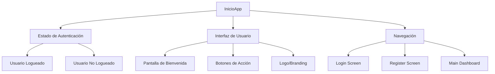
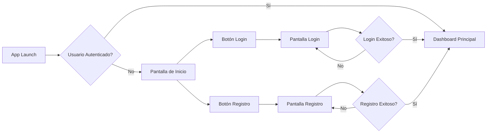
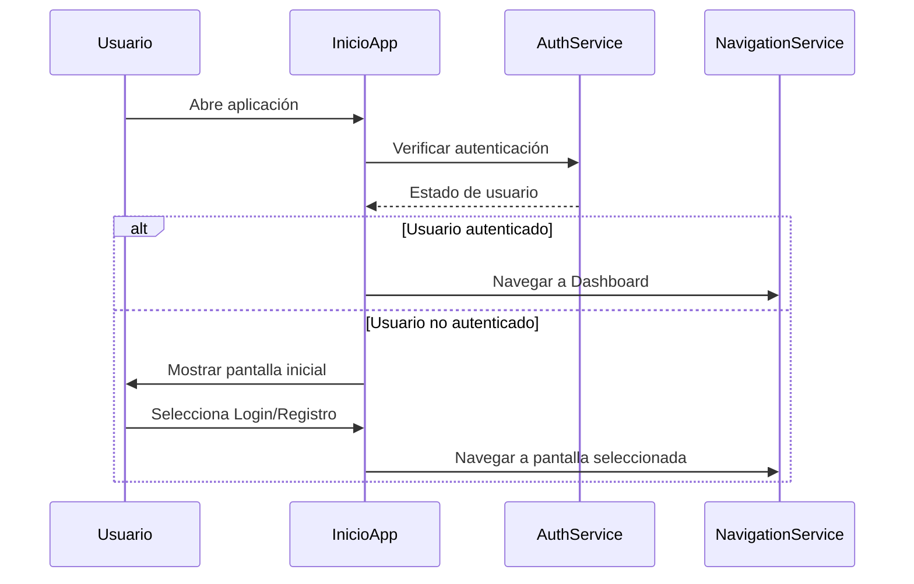

# Documentación - InicioApp

## Descripción General
`InicioApp` es el componente principal de inicio de la aplicación de cuidado obstétrico que gestiona la pantalla de inicio y navegación inicial.

## Arquitectura del Componente



## Estructura del Componente

### Props
| Prop | Tipo | Descripción | Requerido |
|------|------|-------------|-----------|
| navigation | NavigationProp | Objeto de navegación de React Navigation | Sí |
| route | RouteProp | Información de la ruta actual | No |

### Estado Local
```typescript
interface InicioAppState {
  isLoading: boolean;
  userAuthenticated: boolean;
  showSplash: boolean;
}
```

## Flujo de Navegación



## Funcionalidades Principales

### 1. Verificación de Autenticación
- Verifica si el usuario tiene sesión activa
- Redirige automáticamente al dashboard si está autenticado

### 2. Pantalla de Bienvenida
- Muestra información de la aplicación
- Presenta opciones de login y registro
- Incluye branding y elementos visuales

### 3. Navegación
- Maneja la transición entre pantallas
- Gestiona el stack de navegación inicial

## Implementación Técnica

### Hooks Utilizados
- `useState` - Manejo del estado local
- `useEffect` - Verificación inicial de autenticación
- `useNavigation` - Navegación entre pantallas

### Servicios Integrados
- AuthService - Verificación de autenticación
- StorageService - Persistencia de datos de usuario
- NavigationService - Gestión de rutas

## Diagrama de Secuencia



## Estilos y UI

### Elementos Visuales
- Logo de la aplicación
- Colores del tema hospitalario
- Tipografía legible y accesible
- Botones con estados hover/pressed

### Responsive Design
- Adaptable a diferentes tamaños de pantalla
- Orientación portrait y landscape
- Accesibilidad mejorada

## Testing

### Casos de Prueba
1. **Carga inicial**: Verificar renderizado correcto
2. **Usuario autenticado**: Redirección automática
3. **Usuario no autenticado**: Mostrar opciones
4. **Navegación**: Transiciones correctas
5. **Estados de carga**: Indicadores visuales

## Dependencias
- React Navigation
- AsyncStorage
- React Native Elements/UI Library
- Authentication Context

## Notas de Desarrollo
- Implementar splash screen para mejor UX
- Considerar animaciones de transición
- Manejo de errores de red
- Logs para debugging en desarrollo