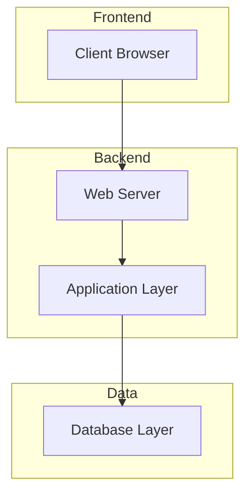
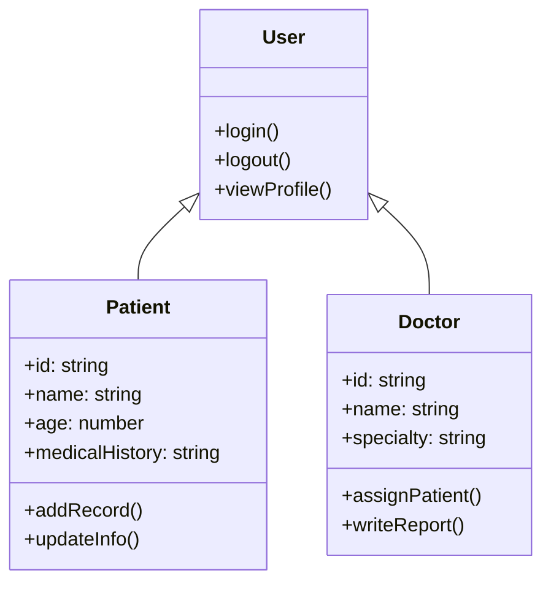
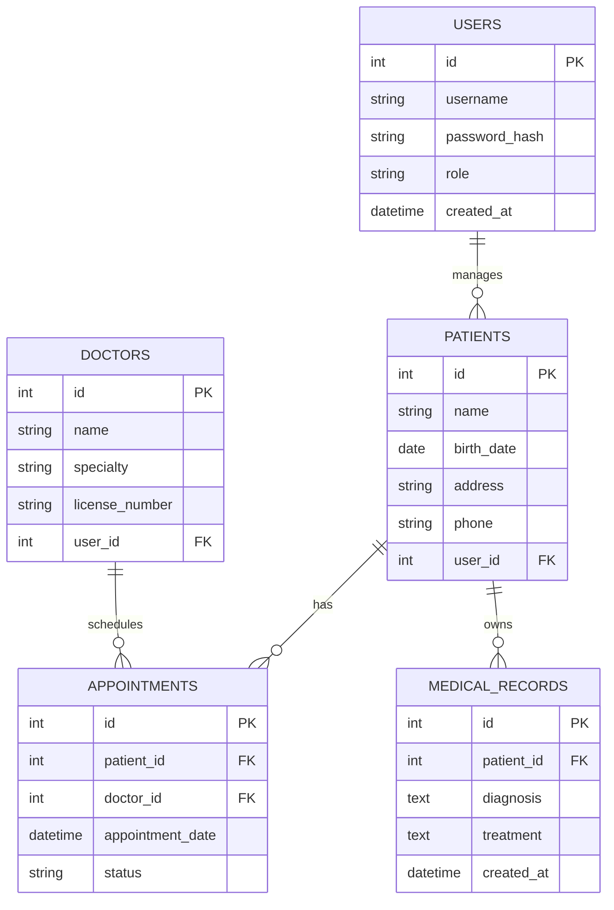
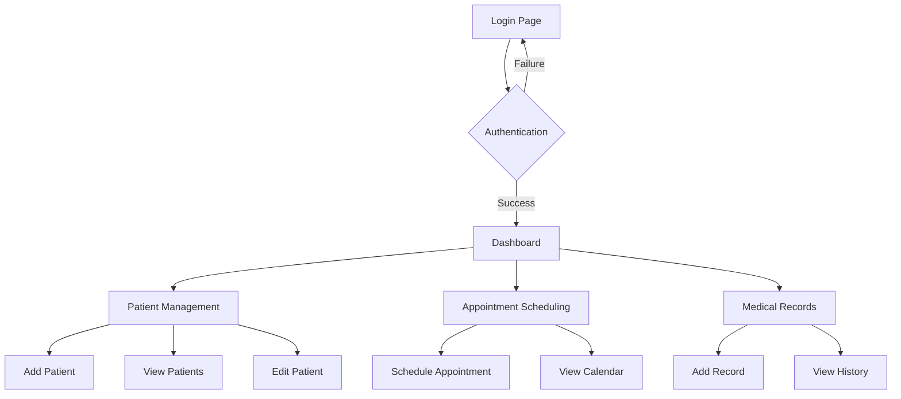
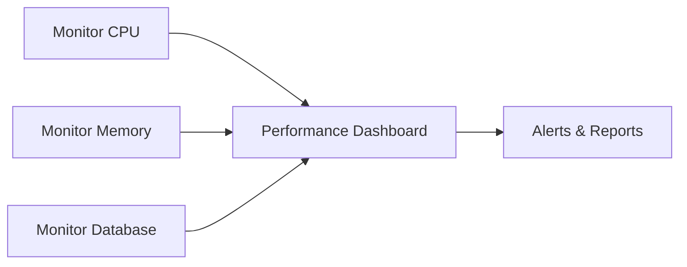

# Legacy App Documentation

## Table of Contents
1. [Overview](#overview)
2. [System Architecture](#system-architecture)
3. [Database Schema](#database-schema)
4. [API Documentation](#api-documentation)
5. [User Interface](#user-interface)
6. [Installation Guide](#installation-guide)
7. [Maintenance](#maintenance)

## Overview

### Project Description
Legacy application for obstetric care management system.

### Technologies Used
- Frontend: HTML, CSS, JavaScript
- Backend: Node.js/PHP
- Database: MySQL/PostgreSQL
- Server: Apache/Nginx

## System Architecture



### Component Diagram



## Database Schema

### Entity Relationship Diagram



## API Documentation

### Authentication Endpoints

| Method | Endpoint | Description |
|--------|----------|-------------|
| POST | `/api/auth/login` | User authentication |
| POST | `/api/auth/logout` | User logout |
| GET | `/api/auth/profile` | Get user profile |

### Patient Management

| Method | Endpoint | Description |
|--------|----------|-------------|
| GET | `/api/patients` | List all patients |
| POST | `/api/patients` | Create new patient |
| GET | `/api/patients/{id}` | Get patient details |
| PUT | `/api/patients/{id}` | Update patient |
| DELETE | `/api/patients/{id}` | Delete patient |

### Appointment System

| Method | Endpoint | Description |
|--------|----------|-------------|
| GET | `/api/appointments` | List appointments |
| POST | `/api/appointments` | Schedule appointment |
| PUT | `/api/appointments/{id}` | Update appointment |
| DELETE | `/api/appointments/{id}` | Cancel appointment |

## User Interface

### Application Flow



### Screen Layouts

#### Dashboard Layout
```
┌─────────────────────────────────────┐
│ Header: Logo | Navigation | Profile │
├─────────────────────────────────────┤
│ Sidebar   │ Main Content Area       │
│ - Patients│ ┌─────────────────────┐ │
│ - Appts   │ │ Quick Actions       │ │
│ - Records │ │ - New Patient       │ │
│ - Reports │ │ - Schedule Appt     │ │
│           │ │ - View Records      │ │
│           │ └─────────────────────┘ │
│           │ Recent Activity         │
└─────────────────────────────────────┘
```

## Installation Guide

### Prerequisites
- Web server (Apache/Nginx)
- Database server (MySQL/PostgreSQL)
- PHP 7.4+ or Node.js 14+

### Installation Steps

1. **Clone Repository**
   ```bash
   git clone <repository-url>
   cd legacyApp
   ```

2. **Database Setup**
   ```sql
   CREATE DATABASE obstetric_care;
   USE obstetric_care;
   SOURCE database/schema.sql;
   ```

3. **Configuration**
   ```bash
   cp config/config.example.php config/config.php
   # Edit database credentials
   ```

4. **Dependencies**
   ```bash
   composer install
   # or
   npm install
   ```

5. **Web Server Configuration**
   ```apache
   <VirtualHost *:80>
       ServerName legacyapp.local
       DocumentRoot /path/to/legacyApp/public
   </VirtualHost>
   ```

## Maintenance

### Backup Procedures
```bash
# Database backup
mysqldump -u user -p obstetric_care > backup_$(date +%Y%m%d).sql

# File backup
tar -czf app_backup_$(date +%Y%m%d).tar.gz /path/to/legacyApp
```

### Log Files
- Application logs: `/var/log/legacyapp/`
- Error logs: `/var/log/apache2/error.log`
- Access logs: `/var/log/apache2/access.log`

### Security Updates
- Regular security patches
- Password policy enforcement
- Session management
- Input validation
- SQL injection prevention

### Performance Monitoring


## Troubleshooting

### Common Issues
1. **Database Connection Error**
   - Check credentials in config file
   - Verify database server status

2. **Session Timeout**
   - Adjust session timeout in configuration
   - Check server time settings

3. **File Upload Issues**
   - Verify file permissions
   - Check upload directory settings

### Support Contact
- Technical Support: support@hospital.com
- System Administrator: admin@hospital.com