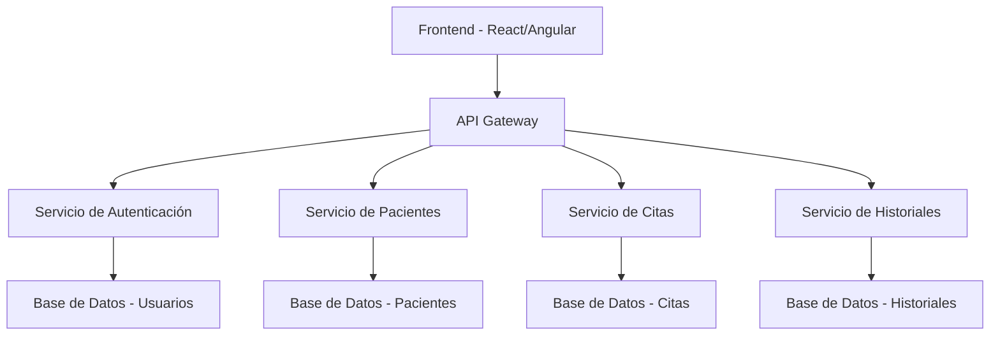
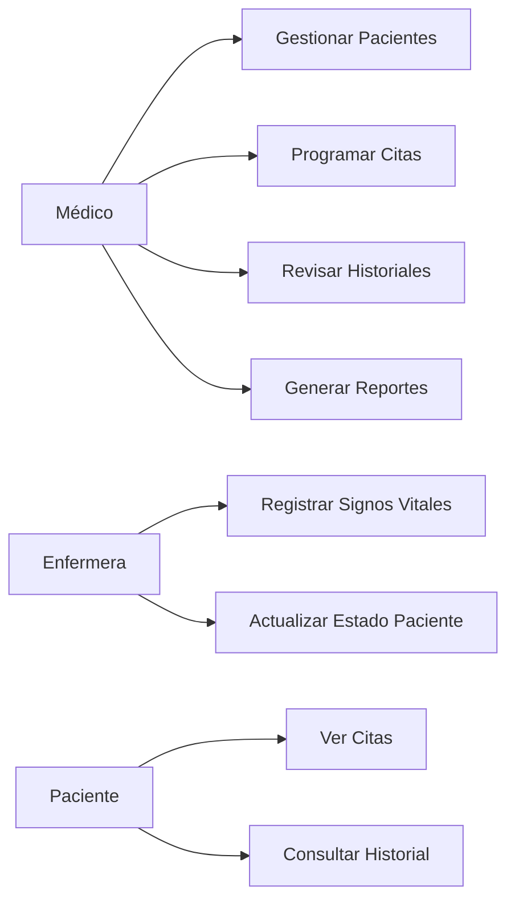
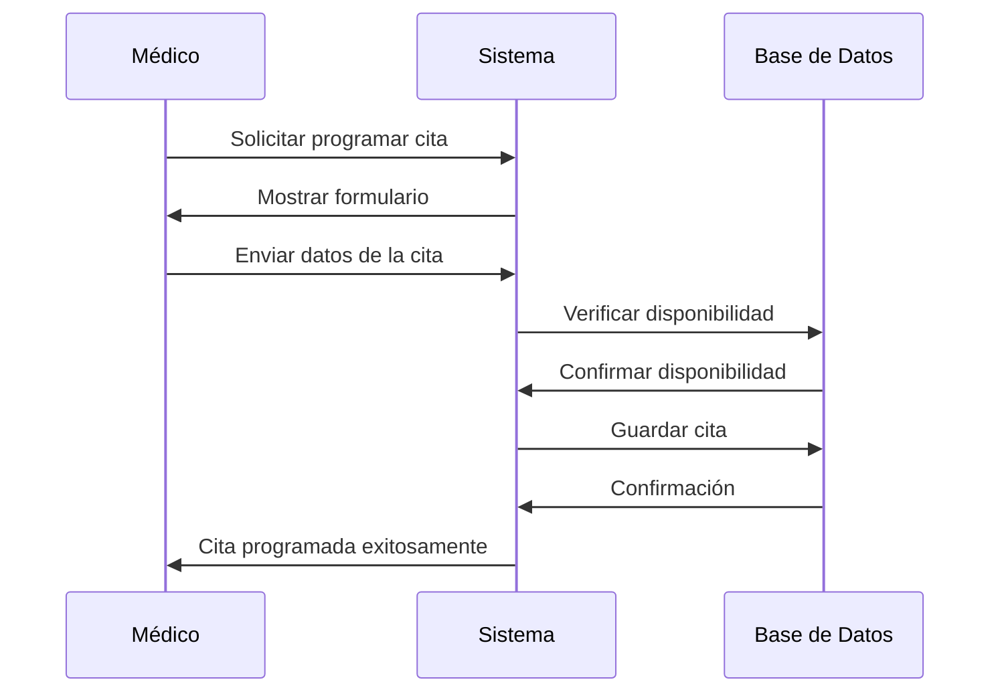

# MedicoApp - Documentación Completa

## Índice
1. [Descripción General](#descripción-general)
2. [Arquitectura del Sistema](#arquitectura-del-sistema)
3. [Casos de Uso](#casos-de-uso)
4. [Diagramas](#diagramas)
5. [Base de Datos](#base-de-datos)
6. [API Endpoints](#api-endpoints)
7. [Instalación y Configuración](#instalación-y-configuración)

## Descripción General

MedicoApp es una aplicación de gestión hospitalaria diseñada para optimizar los procesos de atención médica, especialmente en el área de obstetricia.

### Características Principales
- Gestión de pacientes
- Control de citas médicas
- Historiales clínicos
- Seguimiento obstétrico
- Reportes médicos

## Arquitectura del Sistema



## Casos de Uso

### Actores
- **Médico**: Usuario principal del sistema
- **Enfermera**: Usuario con permisos limitados
- **Administrador**: Gestión completa del sistema
- **Paciente**: Consulta de información básica

### Casos de Uso Principales



## Diagramas

### Diagrama de Clases

```mermaid
classDiagram
    class Usuario {
        +int id
        +string nombre
        +string email
        +string rol
        +datetime fechaCreacion
        +login()
        +logout()
    }
    
    class Paciente {
        +int id
        +string nombre
        +string apellido
        +date fechaNacimiento
        +string genero
        +string telefono
        +string direccion
        +registrar()
        +actualizar()
    }
    
    class Cita {
        +int id
        +int pacienteId
        +int medicoId
        +datetime fechaHora
        +string motivo
        +string estado
        +programar()
        +cancelar()
    }
    
    class HistorialMedico {
        +int id
        +int pacienteId
        +int medicoId
        +datetime fecha
        +string diagnostico
        +string tratamiento
        +crear()
        +actualizar()
    }
    
    Usuario ||--o{ Cita : "programa"
    Paciente ||--o{ Cita : "tiene"
    Paciente ||--o{ HistorialMedico : "posee"
    Usuario ||--o{ HistorialMedico : "crea"
```

### Diagrama de Secuencia - Programar Cita



## Base de Datos

### Esquema de Tablas

```sql
-- Tabla Usuarios
CREATE TABLE usuarios (
    id INT PRIMARY KEY AUTO_INCREMENT,
    nombre VARCHAR(100) NOT NULL,
    email VARCHAR(100) UNIQUE NOT NULL,
    password VARCHAR(255) NOT NULL,
    rol ENUM('medico', 'enfermera', 'admin') NOT NULL,
    fecha_creacion TIMESTAMP DEFAULT CURRENT_TIMESTAMP
);

-- Tabla Pacientes
CREATE TABLE pacientes (
    id INT PRIMARY KEY AUTO_INCREMENT,
    nombre VARCHAR(100) NOT NULL,
    apellido VARCHAR(100) NOT NULL,
    fecha_nacimiento DATE NOT NULL,
    genero ENUM('M', 'F', 'Otro') NOT NULL,
    telefono VARCHAR(20),
    direccion TEXT,
    fecha_registro TIMESTAMP DEFAULT CURRENT_TIMESTAMP
);

-- Tabla Citas
CREATE TABLE citas (
    id INT PRIMARY KEY AUTO_INCREMENT,
    paciente_id INT NOT NULL,
    medico_id INT NOT NULL,
    fecha_hora DATETIME NOT NULL,
    motivo TEXT,
    estado ENUM('programada', 'completada', 'cancelada') DEFAULT 'programada',
    FOREIGN KEY (paciente_id) REFERENCES pacientes(id),
    FOREIGN KEY (medico_id) REFERENCES usuarios(id)
);

-- Tabla Historiales Médicos
CREATE TABLE historiales_medicos (
    id INT PRIMARY KEY AUTO_INCREMENT,
    paciente_id INT NOT NULL,
    medico_id INT NOT NULL,
    fecha DATETIME DEFAULT CURRENT_TIMESTAMP,
    diagnostico TEXT,
    tratamiento TEXT,
    observaciones TEXT,
    FOREIGN KEY (paciente_id) REFERENCES pacientes(id),
    FOREIGN KEY (medico_id) REFERENCES usuarios(id)
);
```

## API Endpoints

### Autenticación
```
POST /api/auth/login
POST /api/auth/logout
POST /api/auth/refresh
```

### Pacientes
```
GET    /api/pacientes          - Listar pacientes
POST   /api/pacientes          - Crear paciente
GET    /api/pacientes/:id      - Obtener paciente
PUT    /api/pacientes/:id      - Actualizar paciente
DELETE /api/pacientes/:id      - Eliminar paciente
```

### Citas
```
GET    /api/citas              - Listar citas
POST   /api/citas              - Programar cita
GET    /api/citas/:id          - Obtener cita
PUT    /api/citas/:id          - Actualizar cita
DELETE /api/citas/:id          - Cancelar cita
```

### Historiales
```
GET    /api/historiales        - Listar historiales
POST   /api/historiales        - Crear historial
GET    /api/historiales/:id    - Obtener historial
PUT    /api/historiales/:id    - Actualizar historial
```

## Instalación y Configuración

### Requisitos Previos
- Node.js >= 14.0
- MySQL >= 8.0
- npm o yarn

### Pasos de Instalación

1. **Clonar el repositorio**
   ```bash
   git clone https://github.com/hospital/medicoapp.git
   cd medicoapp
   ```

2. **Instalar dependencias**
   ```bash
   npm install
   ```

3. **Configurar variables de entorno**
   ```bash
   cp .env.example .env
   # Editar .env con los datos de la base de datos
   ```

4. **Ejecutar migraciones**
   ```bash
   npm run migrate
   ```

5. **Iniciar la aplicación**
   ```bash
   npm start
   ```

### Configuración de Desarrollo

```javascript
// config/development.js
module.exports = {
  database: {
    host: 'localhost',
    port: 3306,
    user: 'root',
    password: 'password',
    database: 'medicoapp_dev'
  },
  server: {
    port: 3000,
    host: 'localhost'
  }
};
```

## Tecnologías Utilizadas

- **Frontend**: React.js, Bootstrap
- **Backend**: Node.js, Express.js
- **Base de Datos**: MySQL
- **Autenticación**: JWT
- **Testing**: Jest, Supertest
- **Documentación**: Swagger/OpenAPI

---

*Documentación generada para MedicoApp v1.0*