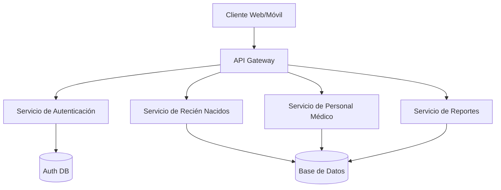
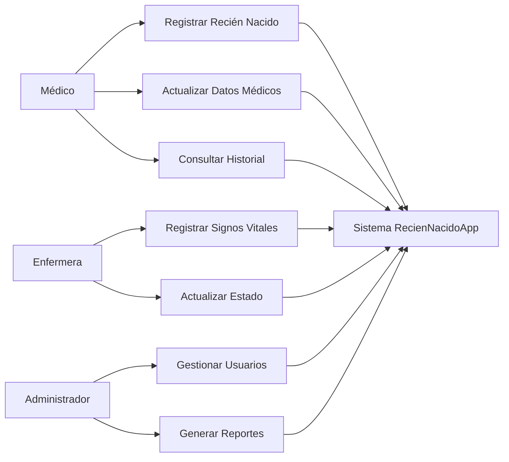
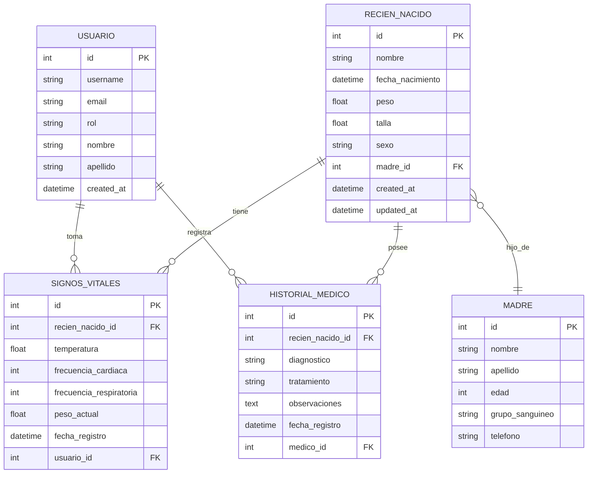
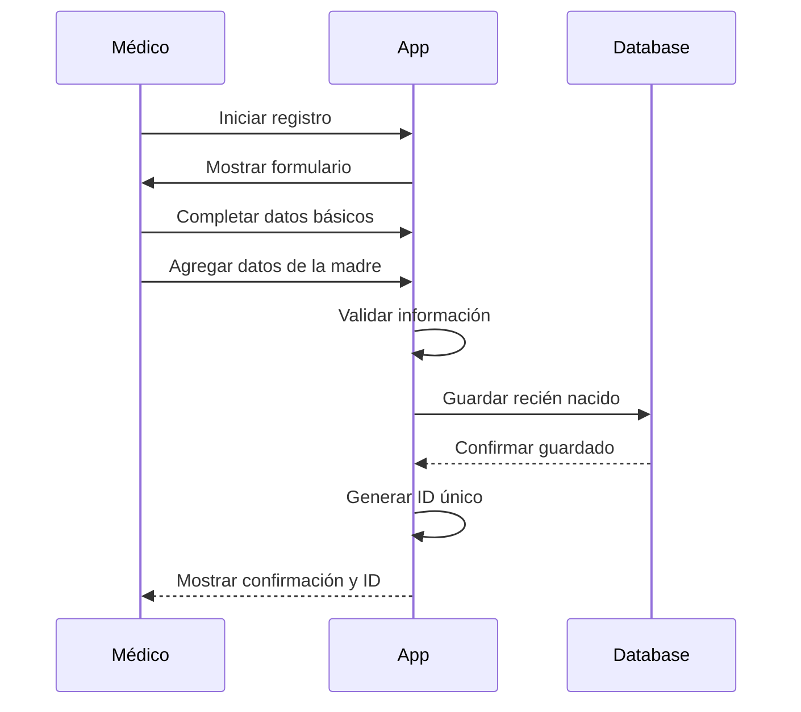
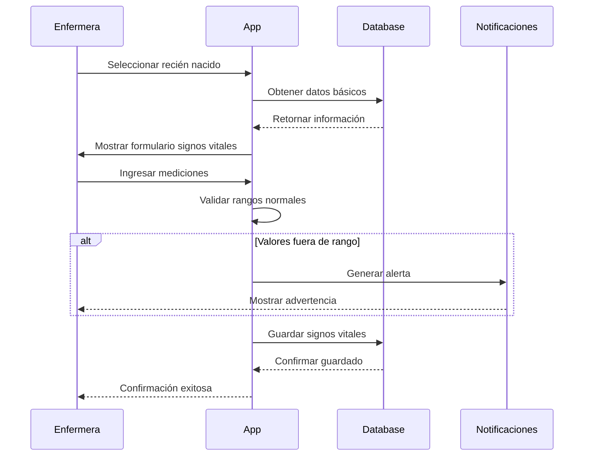

# Documentación - RecienNacidoApp

## Tabla de Contenidos
- [1. Introducción](#1-introducción)
- [2. Arquitectura del Sistema](#2-arquitectura-del-sistema)
- [3. Requisitos](#3-requisitos)
- [4. Casos de Uso](#4-casos-de-uso)
- [5. Modelo de Datos](#5-modelo-de-datos)
- [6. Diagrama de Clases](#6-diagrama-de-clases)
- [7. Flujos de Trabajo](#7-flujos-de-trabajo)
- [8. API Endpoints](#8-api-endpoints)
- [9. Instalación y Configuración](#9-instalación-y-configuración)

## 1. Introducción

### Propósito
RecienNacidoApp es una aplicación para la gestión y seguimiento de recién nacidos en entornos hospitalarios, facilitando el registro de datos vitales, seguimiento médico y comunicación entre el personal sanitario.

### Alcance
- Registro de recién nacidos
- Seguimiento de signos vitales
- Historial médico
- Gestión de personal médico
- Reportes y estadísticas

## 2. Arquitectura del Sistema



## 3. Requisitos

### Funcionales
- **RF01**: Registrar nuevo recién nacido
- **RF02**: Actualizar datos del recién nacido
- **RF03**: Registrar signos vitales
- **RF04**: Generar reportes médicos
- **RF05**: Gestión de usuarios del sistema

### No Funcionales
- **RNF01**: Tiempo de respuesta < 2 segundos
- **RNF02**: Disponibilidad 99.9%
- **RNF03**: Seguridad de datos médicos (HIPAA)
- **RNF04**: Escalabilidad para 1000+ usuarios concurrentes

## 4. Casos de Uso



## 5. Modelo de Datos

### Diagrama Entidad-Relación



## 6. Diagrama de Clases

```mermaid
classDiagram
    class RecienNacido {
        -int id
        -string nombre
        -DateTime fechaNacimiento
        -float peso
        -float talla
        -string sexo
        -Madre madre
        +registrar()
        +actualizar()
        +obtenerHistorial()
        +calcularEdad()
    }
    
    class Madre {
        -int id
        -string nombre
        -string apellido
        -int edad
        -string grupoSanguineo
        +registrar()
        +actualizar()
    }
    
    class SignosVitales {
        -int id
        -float temperatura
        -int frecuenciaCardiaca
        -int frecuenciaRespiratoria
        -DateTime fechaRegistro
        +registrar()
        +validar()
    }
    
    class Usuario {
        -int id
        -string username
        -string email
        -string rol
        +autenticar()
        +cambiarPassword()
    }
    
    class HistorialMedico {
        -int id
        -string diagnostico
        -string tratamiento
        -string observaciones
        +agregar()
        +actualizar()
    }
    
    RecienNacido ||--o{ SignosVitales
    RecienNacido ||--o{ HistorialMedico
    RecienNacido }o--|| Madre
    Usuario ||--o{ HistorialMedico
```

## 7. Flujos de Trabajo

### Flujo de Registro de Recién Nacido



### Flujo de Registro de Signos Vitales



## 8. API Endpoints

### Recién Nacidos
```
GET    /api/recien-nacidos           - Listar todos
GET    /api/recien-nacidos/:id       - Obtener por ID
POST   /api/recien-nacidos           - Crear nuevo
PUT    /api/recien-nacidos/:id       - Actualizar
DELETE /api/recien-nacidos/:id       - Eliminar
```

### Signos Vitales
```
GET    /api/signos-vitales/:recienNacidoId  - Obtener historial
POST   /api/signos-vitales                  - Registrar nuevos
PUT    /api/signos-vitales/:id              - Actualizar registro
```

### Usuarios
```
POST   /api/auth/login              - Iniciar sesión
POST   /api/auth/logout             - Cerrar sesión
GET    /api/usuarios                - Listar usuarios
POST   /api/usuarios                - Crear usuario
```

## 9. Instalación y Configuración

### Requisitos del Sistema
- Node.js >= 14.0
- PostgreSQL >= 12
- Redis >= 6.0

### Pasos de Instalación
```bash
# 1. Clonar repositorio
git clone https://github.com/hospital/recien-nacido-app.git

# 2. Instalar dependencias
npm install

# 3. Configurar base de datos
cp .env.example .env
# Editar variables de entorno

# 4. Ejecutar migraciones
npm run migrate

# 5. Iniciar aplicación
npm start
```

### Variables de Entorno
```
DB_HOST=localhost
DB_PORT=5432
DB_NAME=recien_nacidos_db
DB_USER=postgres
DB_PASS=password
JWT_SECRET=your-secret-key
REDIS_URL=redis://localhost:6379
```
