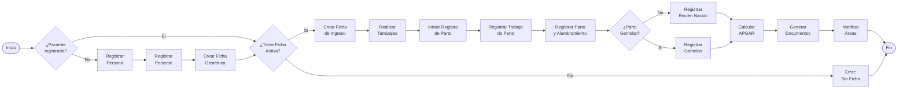

```mermaid
graph LR
    START([Inicio]) --> CHECK_PACIENTE{¿Paciente<br/>registrada?}
    
    CHECK_PACIENTE -->|No| REG_PERSONA[Registrar<br/>Persona]
    CHECK_PACIENTE -->|Sí| CHECK_FICHA
    
    REG_PERSONA --> REG_PACIENTE[Registrar<br/>Paciente]
    REG_PACIENTE --> CREATE_FICHA[Crear Ficha<br/>Obstétrica]
    
    CREATE_FICHA --> CHECK_FICHA{¿Tiene Ficha<br/>Activa?}
    CHECK_FICHA -->|No| ERROR1[Error:<br/>Sin Ficha]
    CHECK_FICHA -->|Sí| CREATE_INGRESO
    
    CREATE_INGRESO[Crear Ficha<br/>de Ingreso] --> TAMIZAJES[Realizar<br/>Tamizajes]
    TAMIZAJES --> REG_PARTO
    
    REG_PARTO[Iniciar Registro<br/>de Parto] --> TRABAJO_PARTO[Registrar Trabajo<br/>de Parto]
    TRABAJO_PARTO --> PARTO_DETALLE[Registrar Parto<br/>y Alumbramiento]
    
    PARTO_DETALLE --> CHECK_GEMELOS{¿Parto<br/>Gemelar?}
    CHECK_GEMELOS -->|No| REG_RN[Registrar<br/>Recién Nacido]
    CHECK_GEMELOS -->|Sí| REG_GEMELOS[Registrar<br/>Gemelos]
    
    REG_RN --> APGAR[Calcular<br/>APGAR]
    REG_GEMELOS --> APGAR
    
    APGAR --> DOCUMENTOS[Generar<br/>Documentos]
    DOCUMENTOS --> NOTIFICAR[Notificar<br/>Áreas]
    
    NOTIFICAR --> END([Fin])
    ERROR1 --> END
```
