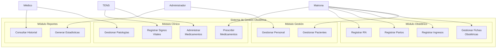

```mermaid
graph TB
    subgraph "Sistema de Gestión Obstétrica"
        subgraph "Módulo Gestión"
            UC1[Gestionar Pacientes]
            UC2[Gestionar Personal]
        end
        
        subgraph "Módulo Obstétrico"
            UC3[Gestionar Fichas<br/>Obstétricas]
            UC4[Registrar Ingresos]
            UC5[Registrar Partos]
            UC6[Registrar RN]
        end
        
        subgraph "Módulo Clínico"
            UC7[Gestionar Patologías]
            UC8[Prescribir<br/>Medicamentos]
            UC9[Administrar<br/>Medicamentos]
            UC10[Registrar Signos<br/>Vitales]
        end
        
        subgraph "Módulo Reportes"
            UC11[Consultar Historial]
            UC12[Generar Estadísticas]
        end
    end
    
    ADMIN[Administrador] --> UC2
    
    MATRONA[Matrona] --> UC1
    MATRONA --> UC3
    MATRONA --> UC4
    MATRONA --> UC5
    MATRONA --> UC6
    MATRONA --> UC8
    
    MEDICO[Médico] --> UC7
    MEDICO --> UC11
    
    TENS[TENS] --> UC9
    TENS --> UC10
    
    ADMIN --> UC12
```
