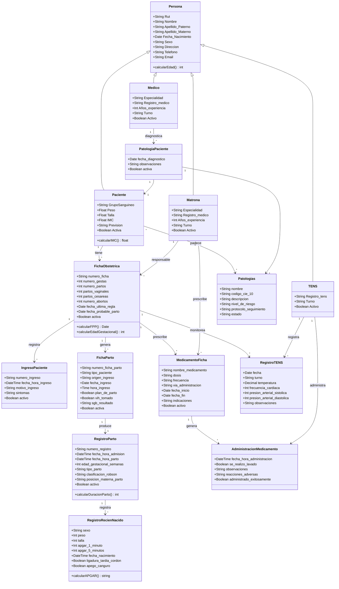

```mermaid
classDiagram
    %% =========================================
    %% CAPA DE GESTIÓN BASE
    %% =========================================
    class Persona {
        +String Rut
        +String Nombre
        +String Apellido_Paterno
        +String Apellido_Materno
        +Date Fecha_Nacimiento
        +String Sexo
        +String Direccion
        +String Telefono
        +String Email
        +calcularEdad() int
    }
    
    class Paciente {
        +String GrupoSanguineo
        +Float Peso
        +Float Talla
        +Float IMC
        +String Prevision
        +Boolean Activa
        +calcularIMC() float
    }
    
    class Matrona {
        +String Especialidad
        +String Registro_medico
        +Int Años_experiencia
        +String Turno
        +Boolean Activo
    }
    
    class Medico {
        +String Especialidad
        +String Registro_medico
        +Int Años_experiencia
        +String Turno
        +Boolean Activo
    }
    
    class TENS {
        +String Registro_tens
        +String Turno
        +Boolean Activo
    }
    
    %% =========================================
    %% MÓDULO OBSTÉTRICO
    %% =========================================
    class FichaObstetrica {
        +String numero_ficha
        +Int numero_gestas
        +Int numero_partos
        +Int partos_vaginales
        +Int partos_cesareas
        +Int numero_abortos
        +Date fecha_ultima_regla
        +Date fecha_probable_parto
        +Boolean activa
        +calcularFPP() Date
        +calcularEdadGestacional() int
    }
    
    class IngresoPaciente {
        +String numero_ingreso
        +DateTime fecha_hora_ingreso
        +String motivo_ingreso
        +String sintomas
        +Boolean activo
    }
    
    class FichaParto {
        +String numero_ficha_parto
        +String tipo_paciente
        +String origen_ingreso
        +Date fecha_ingreso
        +Time hora_ingreso
        +Boolean plan_de_parto
        +Boolean vih_tomado
        +String sgb_resultado
        +Boolean activa
    }
    
    class RegistroParto {
        +String numero_registro
        +DateTime fecha_hora_admision
        +DateTime fecha_hora_parto
        +Int edad_gestacional_semanas
        +String tipo_parto
        +String clasificacion_robson
        +String posicion_materna_parto
        +Boolean activo
        +calcularDuracionParto() int
    }
    
    class RegistroRecienNacido {
        +String sexo
        +Int peso
        +Int talla
        +Int apgar_1_minuto
        +Int apgar_5_minutos
        +DateTime fecha_nacimiento
        +Boolean ligadura_tardia_cordon
        +Boolean apego_canguro
        +calcularAPGAR() string
    }
    
    %% =========================================
    %% MÓDULO MÉDICO
    %% =========================================
    class Patologias {
        +String nombre
        +String codigo_cie_10
        +String descripcion
        +String nivel_de_riesgo
        +String protocolo_seguimiento
        +String estado
    }
    
    class PatologiaPaciente {
        +Date fecha_diagnostico
        +String observaciones
        +Boolean activa
    }
    
    %% =========================================
    %% MÓDULO MEDICAMENTOS
    %% =========================================
    class MedicamentoFicha {
        +String nombre_medicamento
        +String dosis
        +String frecuencia
        +String via_administracion
        +Date fecha_inicio
        +Date fecha_fin
        +String indicaciones
        +Boolean activo
    }
    
    class AdministracionMedicamento {
        +DateTime fecha_hora_administracion
        +Boolean se_realizo_lavado
        +String observaciones
        +String reacciones_adversas
        +Boolean administrado_exitosamente
    }
    
    class RegistroTENS {
        +Date fecha
        +String turno
        +Decimal temperatura
        +Int frecuencia_cardiaca
        +Int presion_arterial_sistolica
        +Int presion_arterial_diastolica
        +String observaciones
    }
    
    %% =========================================
    %% RELACIONES
    %% =========================================
    Persona <|-- Paciente
    Persona <|-- Matrona
    Persona <|-- Medico
    Persona <|-- TENS
    
    Paciente "1" --> "*" FichaObstetrica : tiene
    Matrona "1" --> "*" FichaObstetrica : responsable
    
    FichaObstetrica "1" --> "*" IngresoPaciente : registra
    FichaObstetrica "1" --> "*" FichaParto : genera
    FichaParto "1" --> "1" RegistroParto : produce
    RegistroParto "1" --> "*" RegistroRecienNacido : registra
    
    Paciente "*" --> "*" Patologias : padece
    PatologiaPaciente "1" --> "1" Paciente
    PatologiaPaciente "1" --> "1" Patologias
    Medico "1" --> "*" PatologiaPaciente : diagnostica
    
    FichaObstetrica "1" --> "*" MedicamentoFicha : prescribe
    Matrona "1" --> "*" MedicamentoFicha : prescribe
    MedicamentoFicha "1" --> "*" AdministracionMedicamento : genera
    TENS "1" --> "*" AdministracionMedicamento : administra
    
    FichaObstetrica "1" --> "*" RegistroTENS : monitorea
    TENS "1" --> "*" RegistroTENS : registra
```
