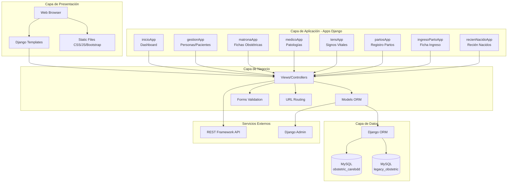

```mermaid
graph TB
    subgraph "Capa de Presentación"
        WEB[Web Browser]
        TEMPLATES[Django Templates]
        STATIC[Static Files CSS/JS/Bootstrap]
    end
    
    subgraph "Capa de Aplicación - Apps Django"
        INICIO[inicioApp<br/>Dashboard]
        GESTION[gestionApp<br/>Personas/Pacientes]
        MATRONA[matronaApp<br/>Fichas Obstétricas]
        MEDICO[medicoApp<br/>Patologías]
        TENS[tensApp<br/>Signos Vitales]
        PARTO[partosApp<br/>Registro Partos]
        INGRESO[ingresoPartoApp<br/>Ficha Ingreso]
        RN[recienNacidoApp<br/>Recién Nacidos]
    end
    
    subgraph "Capa de Negocio"
        MODELS[Models ORM]
        FORMS[Forms Validation]
        VIEWS[Views/Controllers]
        URLS[URL Routing]
    end
    
    subgraph "Capa de Datos"
        DJANGO_ORM[Django ORM]
        DB_MAIN[(MySQL<br/>obstetric_carebdd)]
        DB_LEGACY[(MySQL<br/>legacy_obstetric)]
    end
    
    subgraph "Servicios Externos"
        API_REST[REST Framework API]
        ADMIN[Django Admin]
    end
    
    WEB --> TEMPLATES
    WEB --> STATIC
    TEMPLATES --> VIEWS
    
    INICIO --> VIEWS
    GESTION --> VIEWS
    MATRONA --> VIEWS
    MEDICO --> VIEWS
    TENS --> VIEWS
    PARTO --> VIEWS
    INGRESO --> VIEWS
    RN --> VIEWS
    
    VIEWS --> URLS
    VIEWS --> FORMS
    VIEWS --> MODELS
    
    MODELS --> DJANGO_ORM
    DJANGO_ORM --> DB_MAIN
    DJANGO_ORM --> DB_LEGACY
    
    VIEWS --> API_REST
    MODELS --> ADMIN
```
