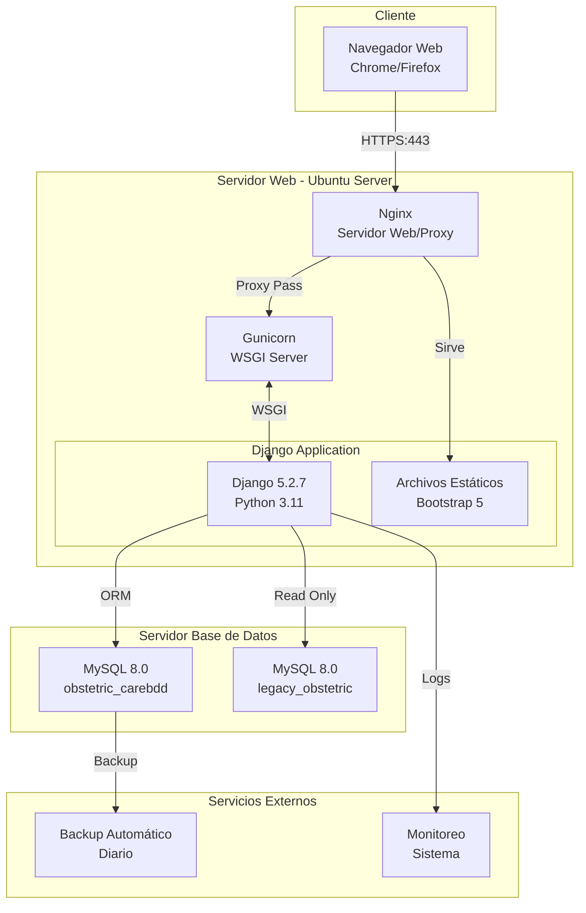

```mermaid
graph TB
    subgraph "Cliente"
        BROWSER[Navegador Web<br/>Chrome/Firefox]
    end
    
    subgraph "Servidor Web - Ubuntu Server"
        NGINX[Nginx<br/>Servidor Web/Proxy]
        GUNICORN[Gunicorn<br/>WSGI Server]
        
        subgraph "Django Application"
            APP[Django 5.2.7<br/>Python 3.11]
            STATIC_SERVE[Archivos Estáticos<br/>Bootstrap 5]
        end
    end
    
    subgraph "Servidor Base de Datos"
        MYSQL[MySQL 8.0<br/>obstetric_carebdd]
        MYSQL_LEGACY[MySQL 8.0<br/>legacy_obstetric]
    end
    
    subgraph "Servicios Externos"
        BACKUP[Backup Automático<br/>Diario]
        MONITOR[Monitoreo<br/>Sistema]
    end
    
    BROWSER -->|HTTPS:443| NGINX
    NGINX -->|Proxy Pass| GUNICORN
    GUNICORN <-->|WSGI| APP
    NGINX -->|Sirve| STATIC_SERVE
    
    APP -->|ORM| MYSQL
    APP -->|Read Only| MYSQL_LEGACY
    
    MYSQL -->|Backup| BACKUP
    APP -->|Logs| MONITOR
```
