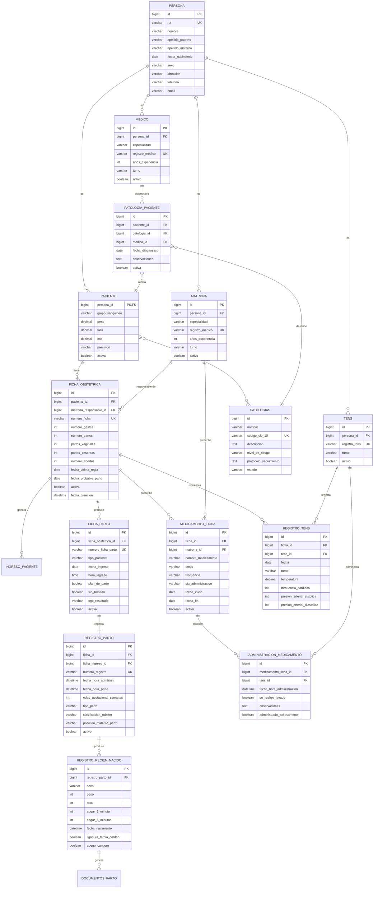

```mermaid
erDiagram
    PERSONA ||--o{ PACIENTE : "es"
    PERSONA ||--o{ MATRONA : "es"
    PERSONA ||--o{ MEDICO : "es"
    PERSONA ||--o{ TENS : "es"
    
    PACIENTE ||--o{ FICHA_OBSTETRICA : "tiene"
    MATRONA ||--o{ FICHA_OBSTETRICA : "responsable de"
    
    FICHA_OBSTETRICA ||--o{ INGRESO_PACIENTE : "genera"
    FICHA_OBSTETRICA ||--o{ FICHA_PARTO : "produce"
    FICHA_PARTO ||--|| REGISTRO_PARTO : "registra"
    
    REGISTRO_PARTO ||--o{ REGISTRO_RECIEN_NACIDO : "produce"
    REGISTRO_RECIEN_NACIDO ||--o{ DOCUMENTOS_PARTO : "genera"
    
    PACIENTE }o--o{ PATOLOGIAS : "padece"
    PATOLOGIA_PACIENTE }o--|| PACIENTE : "afecta"
    PATOLOGIA_PACIENTE }o--|| PATOLOGIAS : "describe"
    MEDICO ||--o{ PATOLOGIA_PACIENTE : "diagnostica"
    
    FICHA_OBSTETRICA ||--o{ MEDICAMENTO_FICHA : "prescribe"
    MATRONA ||--o{ MEDICAMENTO_FICHA : "prescribe"
    MEDICAMENTO_FICHA ||--o{ ADMINISTRACION_MEDICAMENTO : "produce"
    TENS ||--o{ ADMINISTRACION_MEDICAMENTO : "administra"
    
    FICHA_OBSTETRICA ||--o{ REGISTRO_TENS : "monitorea"
    TENS ||--o{ REGISTRO_TENS : "registra"
    
    PERSONA {
        bigint id PK
        varchar rut UK
        varchar nombre
        varchar apellido_paterno
        varchar apellido_materno
        date fecha_nacimiento
        varchar sexo
        varchar direccion
        varchar telefono
        varchar email
    }
    
    PACIENTE {
        bigint persona_id PK,FK
        varchar grupo_sanguineo
        decimal peso
        decimal talla
        decimal imc
        varchar prevision
        boolean activa
    }
    
    MATRONA {
        bigint id PK
        bigint persona_id FK
        varchar especialidad
        varchar registro_medico UK
        int años_experiencia
        varchar turno
        boolean activo
    }
    
    MEDICO {
        bigint id PK
        bigint persona_id FK
        varchar especialidad
        varchar registro_medico UK
        int años_experiencia
        varchar turno
        boolean activo
    }
    
    TENS {
        bigint id PK
        bigint persona_id FK
        varchar registro_tens UK
        varchar turno
        boolean activo
    }
    
    FICHA_OBSTETRICA {
        bigint id PK
        bigint paciente_id FK
        bigint matrona_responsable_id FK
        varchar numero_ficha UK
        int numero_gestas
        int numero_partos
        int partos_vaginales
        int partos_cesareas
        int numero_abortos
        date fecha_ultima_regla
        date fecha_probable_parto
        boolean activa
        datetime fecha_creacion
    }
    
    FICHA_PARTO {
        bigint id PK
        bigint ficha_obstetrica_id FK
        varchar numero_ficha_parto UK
        varchar tipo_paciente
        date fecha_ingreso
        time hora_ingreso
        boolean plan_de_parto
        boolean vih_tomado
        varchar sgb_resultado
        boolean activa
    }
    
    REGISTRO_PARTO {
        bigint id PK
        bigint ficha_id FK
        bigint ficha_ingreso_id FK
        varchar numero_registro UK
        datetime fecha_hora_admision
        datetime fecha_hora_parto
        int edad_gestacional_semanas
        varchar tipo_parto
        varchar clasificacion_robson
        varchar posicion_materna_parto
        boolean activo
    }
    
    REGISTRO_RECIEN_NACIDO {
        bigint id PK
        bigint registro_parto_id FK
        varchar sexo
        int peso
        int talla
        int apgar_1_minuto
        int apgar_5_minutos
        datetime fecha_nacimiento
        boolean ligadura_tardia_cordon
        boolean apego_canguro
    }
    
    PATOLOGIAS {
        bigint id PK
        varchar nombre
        varchar codigo_cie_10 UK
        text descripcion
        varchar nivel_de_riesgo
        text protocolo_seguimiento
        varchar estado
    }
    
    PATOLOGIA_PACIENTE {
        bigint id PK
        bigint paciente_id FK
        bigint patologia_id FK
        bigint medico_id FK
        date fecha_diagnostico
        text observaciones
        boolean activa
    }
    
    MEDICAMENTO_FICHA {
        bigint id PK
        bigint ficha_id FK
        bigint matrona_id FK
        varchar nombre_medicamento
        varchar dosis
        varchar frecuencia
        varchar via_administracion
        date fecha_inicio
        date fecha_fin
        boolean activo
    }
    
    ADMINISTRACION_MEDICAMENTO {
        bigint id PK
        bigint medicamento_ficha_id FK
        bigint tens_id FK
        datetime fecha_hora_administracion
        boolean se_realizo_lavado
        text observaciones
        boolean administrado_exitosamente
    }
    
    REGISTRO_TENS {
        bigint id PK
        bigint ficha_id FK
        bigint tens_id FK
        date fecha
        varchar turno
        decimal temperatura
        int frecuencia_cardiaca
        int presion_arterial_sistolica
        int presion_arterial_diastolica
    }
```
