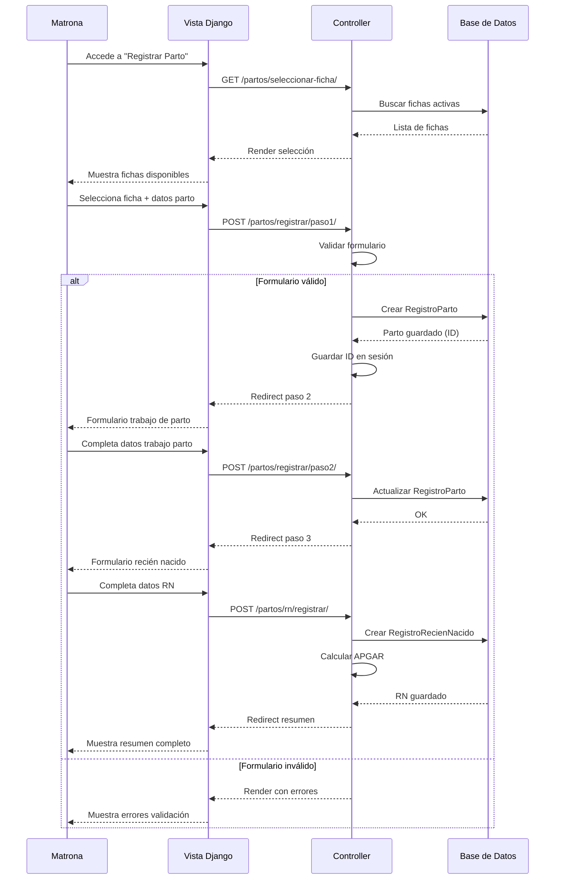

```mermaid
sequenceDiagram
    participant M as Matrona
    participant V as Vista Django
    participant C as Controller
    participant DB as Base de Datos
    
    M->>V: Accede a "Registrar Parto"
    V->>C: GET /partos/seleccionar-ficha/
    C->>DB: Buscar fichas activas
    DB-->>C: Lista de fichas
    C-->>V: Render selección
    V-->>M: Muestra fichas disponibles
    
    M->>V: Selecciona ficha + datos parto
    V->>C: POST /partos/registrar/paso1/
    C->>C: Validar formulario
    
    alt Formulario válido
        C->>DB: Crear RegistroParto
        DB-->>C: Parto guardado (ID)
        C->>C: Guardar ID en sesión
        C-->>V: Redirect paso 2
        V-->>M: Formulario trabajo de parto
        
        M->>V: Completa datos trabajo parto
        V->>C: POST /partos/registrar/paso2/
        C->>DB: Actualizar RegistroParto
        DB-->>C: OK
        C-->>V: Redirect paso 3
        V-->>M: Formulario recién nacido
        
        M->>V: Completa datos RN
        V->>C: POST /partos/rn/registrar/
        C->>DB: Crear RegistroRecienNacido
        C->>C: Calcular APGAR
        DB-->>C: RN guardado
        C-->>V: Redirect resumen
        V-->>M: Muestra resumen completo
    else Formulario inválido
        C-->>V: Render con errores
        V-->>M: Muestra errores validación
    end
```
